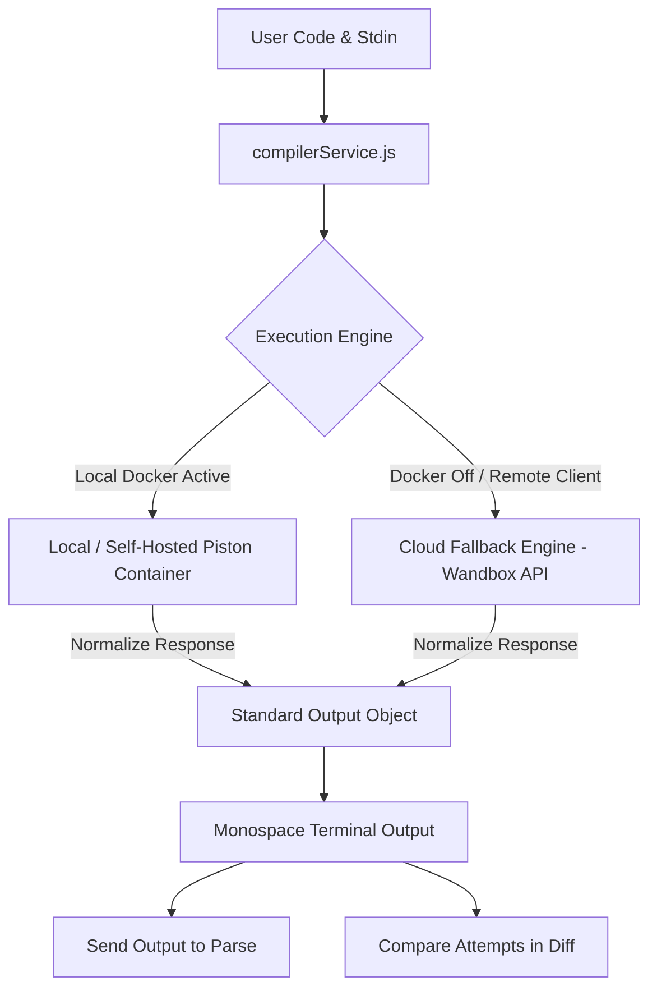

# Code Compiler & Execution Engine - Architecture & Design

## 1. Overview & Motivation

The **Code Compiler (`/compile`)** transforms JSON Playground into a unified platform for software engineers practicing interview problems, testing scripts, and debugging data-processing pipelines.

### The Problem It Solves
When preparing for technical interviews or testing backend scripts, developers typically juggle multiple disconnected tools:
1. An online compiler (LeetCode, HackerRank, or standalone runners).
2. A diff checker to compare brute-force vs. optimal solutions.
3. A JSON formatter to inspect and validate output trees, graphs, or API payloads.

JSON Playground combines these into a single cohesive workflow:
```
Write & Run Code (`/compile`) ──► Valid JSON stdout? ──► Send to Parse (`/parse`)
          │
          └──► Snapshot Attempt 1 vs. Attempt 2 ──► Compare Attempts (`/compare`)
```

---

## 2. Architectural Design & Approach

### Dual-Engine Hybrid Strategy
Because running arbitrary user code requires sandboxed isolation and low latency without recurring infrastructure costs, the system uses a **Dual-Engine Adapter Pattern**:



#### 1. Primary Engine: Self-Hosted Piston Container
- **Technology**: Dockerized [Piston Engine](https://github.com/engineer-man/piston) (`ghcr.io/engineer-man/piston`).
- **Isolation**: Linux kernel namespaces (`isolate`) and cgroups.
- **Port**: `http://localhost:2000` (development) or custom remote host.
- **Persistent Volume**: Container volume mounts `/piston/packages` so installed language runtimes persist across restarts.
- **CORS Handling**: Proxied via Create React App's development proxy (`package.json`: `"proxy": "http://localhost:2000"`).

#### 2. Cloud Fallback Engine: Wandbox REST API
- **Technology**: Public REST API (`https://wandbox.org/api/compile.json`).
- **Cost**: 100% Free, zero authentication, no API keys, no credit card.
- **CORS**: Native `access-control-allow-origin: *` support.
- **Zero-Crash Resilience**: If Docker is stopped, asleep, or if the frontend is viewed on Vercel without a local container, execution seamlessly falls back to Wandbox.

#### 3. Smart Offline Caching
- When a connection to local Piston fails (`ECONNREFUSED`), the service caches the offline state for 30 seconds. Subsequent code executions route immediately to the Cloud Engine without stalling on proxy connection timeouts.

---

## 3. Supported Languages & Runtimes

| Language | Ace Editor Mode | Piston Runtime | Wandbox Compiler | File Extension |
| :--- | :--- | :--- | :--- | :--- |
| **JavaScript** | `javascript` | Node.js v20.11.1 | `nodejs-20.17.0` | `.js` |
| **TypeScript** | `typescript` | TypeScript v5.0.3 | `typescript-5.6.2` | `.ts` |
| **Python** | `python` | Python v3.12.0 | `cpython-3.12.7` | `.py` |
| **Java** | `java` | OpenJDK v15.0.2 | `openjdk-jdk-22+36` | `.java` |
| **C++** | `c_cpp` | GCC v10.2.0 | `gcc-head` | `.cpp` |
| **C** | `c_cpp` | GCC v10.2.0 | `gcc-head-c` | `.c` |
| **Go** | `golang` | Go v1.16.2 | `go-1.23.2` | `.go` |

### Special Language Handling: Java Compilation
- **Issue**: The Java compiler (`javac`) requires any `public class Foo` to reside in a file named `Foo.java`. Single-file cloud runners save code as generic files (e.g., `prog.java`).
- **Solution**: The service automatically normalizes top-level `public class <Name>` to package-private `class <Name>`. This allows Java code to compile and execute cleanly regardless of class naming.

---

## 4. Cross-Feature Integrations

### 1. Pipeline: "Send Output to Parse" (`/parse`)
When an algorithm outputs JSON (e.g. `print(json.dumps(result))` or `console.log(JSON.stringify(tree))`):
- The terminal detects valid JSON syntax (`{...}` or `[...]`).
- A **"Send to Parse"** button appears in the terminal metadata bar.
- Clicking sets `localStorage.setItem('lastJsonInput', stdout)` and navigates to `/parse`.
- The user can instantly format, tree-view, or inspect data structures.

### 2. Pipeline: "Compare Attempts" (`/compare`)
When iterating on algorithms (e.g. $O(N^2)$ brute-force vs. $O(N)$ hash map):
- Clicking **"Snapshot for Compare"** stores the initial code attempt.
- The user writes their optimized version.
- Clicking **"Compare Attempts"** sets:
  - `localStorage.setItem('compareInputOne', previousSnapshot)` (Left side)
  - `localStorage.setItem('compareInputTwo', currentCode)` (Right side)
- The app navigates to `/compare` with word- and token-level diffing preloaded.

---

## 5. File Structure

```
src/
├── components/
│   └── Compiler/
│       ├── Compiler.js        # Main UI component (Editor, Terminal, Stdin, Modal)
│       └── compiler.css       # Responsive dark-theme styling (merbivore_soft)
└── services/
    └── compilerService.js     # Unified execution service, engine routing, fallback
scripts/
├── setup-piston.sh            # Local Mac Docker startup & language installer
└── deploy-cloud.sh            # Cloud VM one-command installer (Oracle/AWS/Ubuntu)
docker-compose.yml             # Local Piston container definition with volume mounts
```

---

## 6. Service API Contracts

### `executeCode(params)`
```typescript
interface ExecuteParams {
  languageId: 'javascript' | 'typescript' | 'python' | 'java' | 'cpp' | 'c' | 'go';
  code: string;
  stdin?: string;
  preferredEngine?: 'auto' | 'piston' | 'wandbox';
}

interface ExecuteResult {
  stdout: string;
  stderr: string;
  exitCode: number;
  executionTimeMs: number;
  engine: 'piston' | 'wandbox' | 'wandbox (fallback)';
  hasError: boolean;
  warning?: string;
}
```

### `checkPistonHealth(customUrl?)`
```typescript
interface HealthResult {
  ok: boolean;
  latencyMs?: number;
  runtimesCount?: number;
  runtimes?: Array<{ language: string; version: string }>;
  error?: string;
}
```

---

## 7. Deployment Options

### Local Development (Mac)
```bash
# Start container and install runtimes:
./scripts/setup-piston.sh

# Stop container anytime to save RAM:
docker compose down
```

### Cloud VM (Oracle Always Free / AWS)
```bash
# SSH into Ubuntu VM and run:
bash scripts/deploy-cloud.sh
```

### Production on Vercel
- If no custom backend URL is configured in `.env`, the frontend runs automatically via the **Wandbox Cloud Engine** at zero cost with zero server maintenance.
